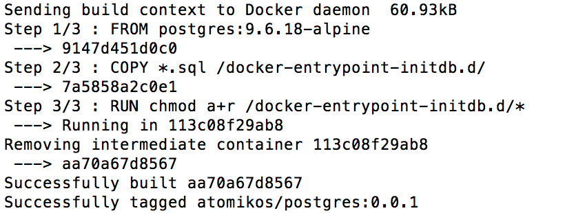
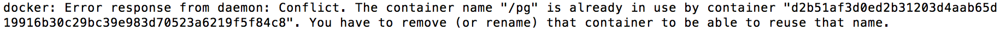
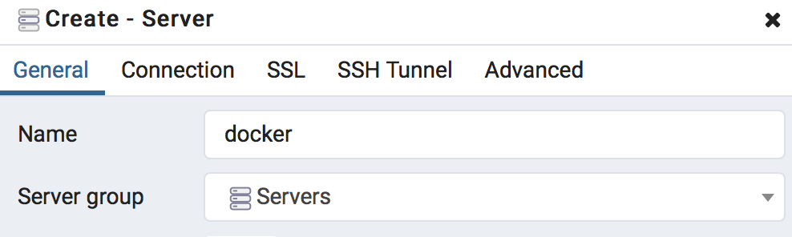
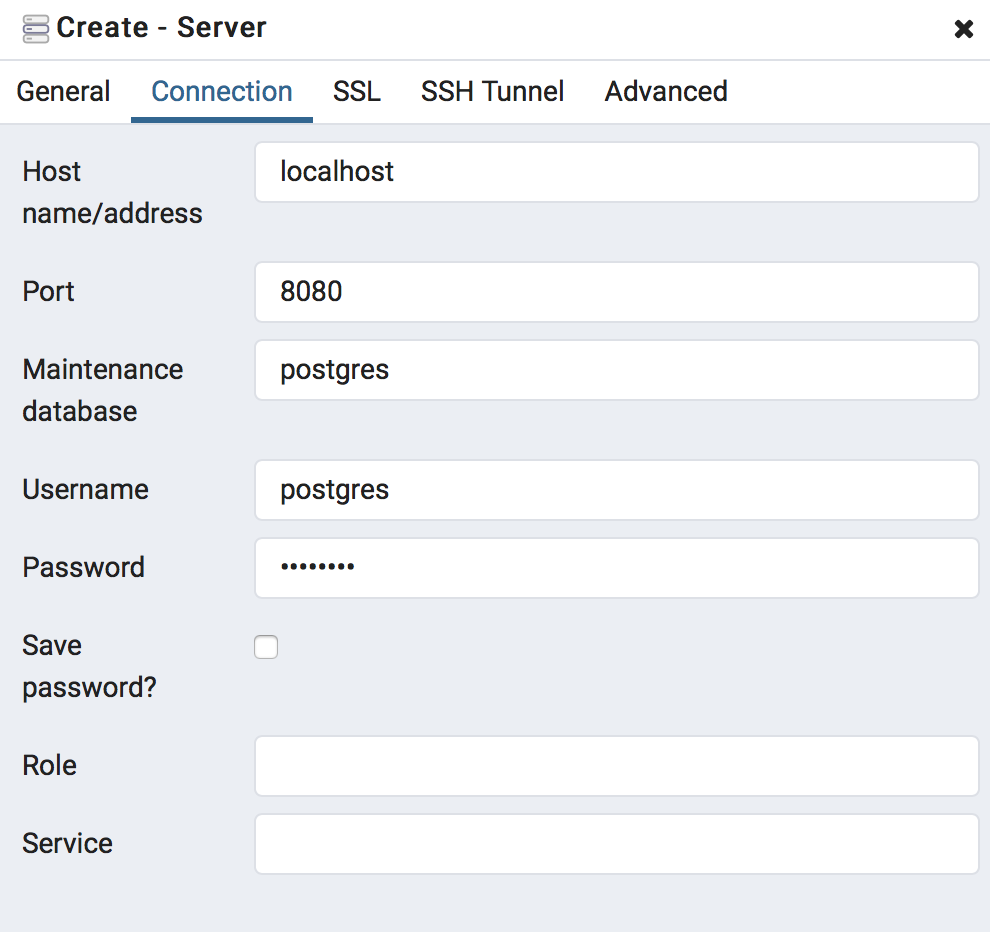
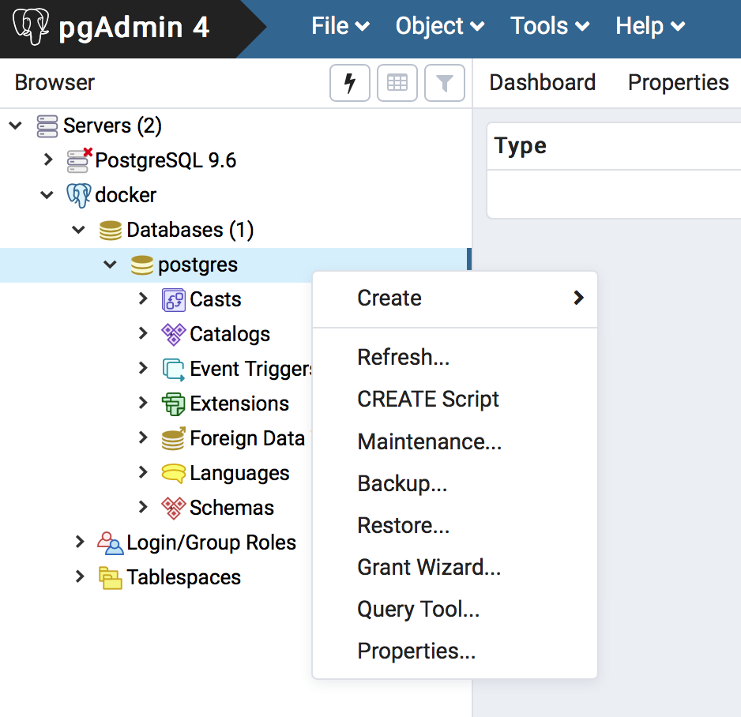
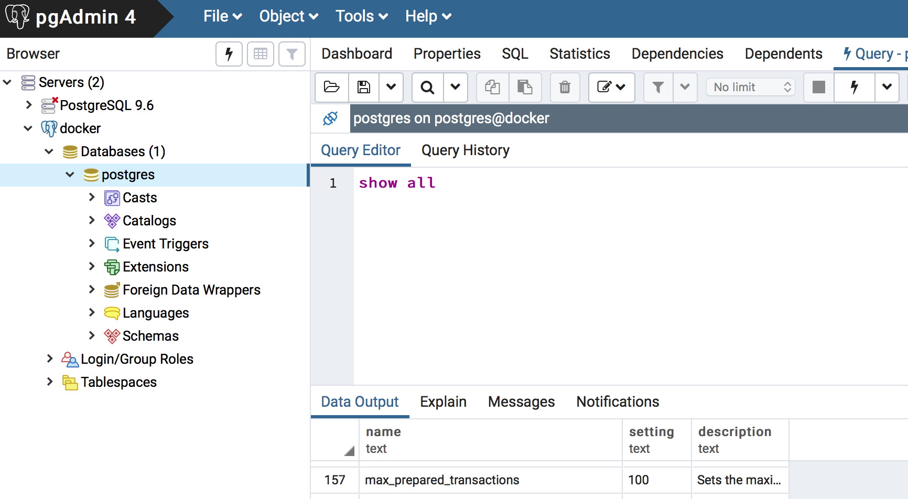

# Configuring PostgreSQL For XA

This project generates a docker image with PostgreSQL and XA enabled.

## Instructions

### Build the image:
   
		docker build -t atomikos/postgres:0.0.1 .docker build -t atomikos/postgres:0.0.1 .
		
You should see something like this:

<p align="center"></p>


### Run the image:
      
	docker run -d -p 8080:5432 --name pg -v $PWD/data:/var/lib/postgresql/data -e POSTGRES_PASSWORD=atomikos <IMAGE_ID>
	
Where IMAGE_ID is the last number generated in the previous step, i.e. aa70a67d8567 for the image shown above.

### Possible error:

You may see an error like this one:

<p align="center"></p>

See the troubleshooting section below for what to do.

## Testing

Testing can be done with the pgAdmin application:

### Create Server

Create (add) a new server to your admin tool, by right-clicking the *Servers* icon in the left pane:

<p align="center"></p>

#### Configure Server Name

Set the name of the new server to, for instance, *docker*:

<p align="center"></p>

#### Configure Connection Parameters

Use the following settings for the Connection tab:

<p align="center"></p>

NB: the password is *atomikos*

### Open the Query Tool

In the left tab, navigate to your *postgres* database instance, and right-click it to open a Query Tool window:

<p align="center"></p>

### Show All

In the query tool, type

	show all
	
then hit the flash icon at the top of the window:

<p align="center"></p>

You should see *max_prepared_transactions=100*.
 
## Troubleshooting

You may see the following error while attempting to run the image:

```
docker: Error response from daemon: Conflict. The container name "/pg" is already in use by container "d2b51af3d0ed2b31203d4aab65d19916b30c29bc39e983d70523a6219f5f84c8". You have to remove (or rename) that container to be able to reuse that name.
See 'docker run --help'.
```

In that case, you may need to stop and remove any previous instance (only do this if you are sure you don't need it any more):

		docker stop pg
		docker rm pg
		
